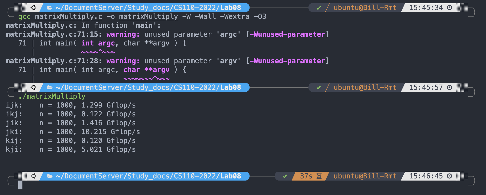
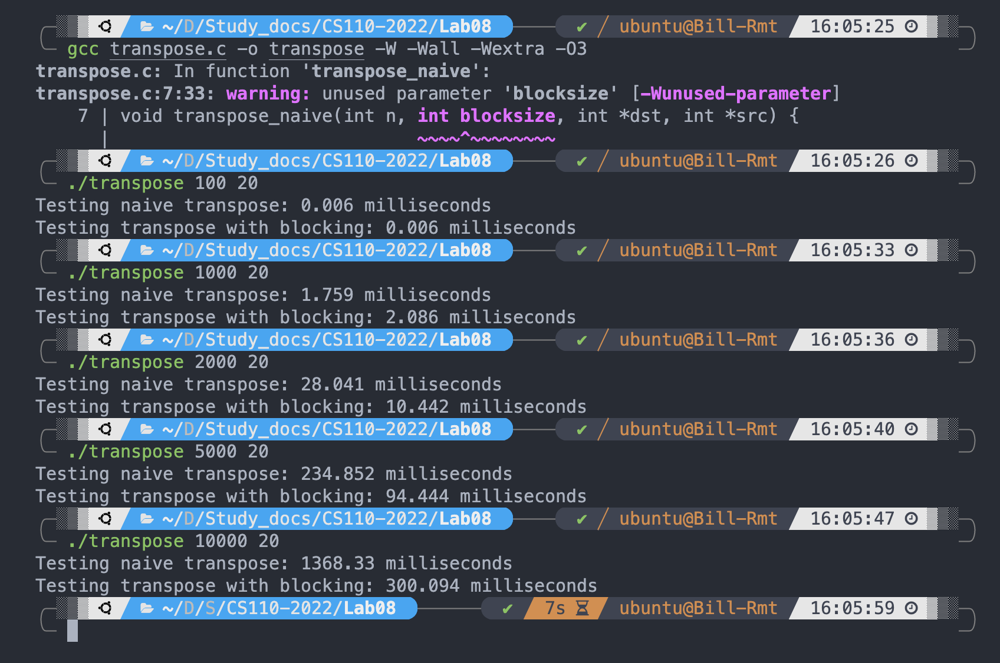
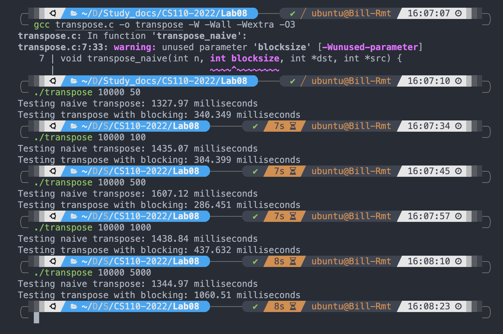

# Lab 8

## 8-1 Exercise1

### Senario1

> Associativity: 1 (Venus won't let you change this, why?)

​		We've selected 'directly mapped cache'.

> Cache Size (Bytes): 32 (Why?)

​		8 bytes per block, and we have 4 blocks, thus the cache size is 32 bytes


#### Question 1. Hit rate

The hit rate is 0.

Suppose the first time we are writing to address `0x10008000`, it goes into the first set (by direct mapping), and cache miss (**compulsory miss**). Now `0x10008000` along with `0x10008004` is in the first set of the cache (since the block size is 8 bytes)

Then the second time we are writing to address `0x10008020` (since the step size is 8), it **also goes into the first set**, and cache miss **(conflict miss)**.  Now `0x10008020` is in the first set, evicting the `0x10008000`.

The third time, we write to `0x10008040`, and cache miss as well.

Similarly, inside every rep count, all cache miss happens, causing the final hit rate to be 0. The reason is mainly that, the cache block size and step size leads to it that **each time we are visiting the same set of the cache** (while the address (or tag) is different).

```
0x10008000 set1 miss (compulsory miss)
0x10008020 set1 miss (conflict miss)
0x10008040 set1 miss (conflict miss)
0x10008060 set1 miss (conflict miss)
......
```


#### Question 2. Increase Rep Count arbitrarily

No matter what the rep count is, the hit rate will always be zero.

The reason is the same: the cache block size is 8 bytes, while the step size is also 8-Bytes. **Each time we are visiting the same set of the cache** (while the address is different), so we encounter a cache miss in every memory access.


#### Question 3. Modify program parameters to max hit rate

We want to take advantage of **temporal locality**, so we set `option` to 1 (Read and write). 

Also, we want to benefit from **spacial locality**, so we set `stepsize` to `1`. After that, for example, the first time we are visiting address `0x10008000`, and the next time we are visiting `0x10008004`, the second visit can benefit from the first one, since both address are already in the cache. (Note the block size is 8).

The memory access address (suppose the first address is `0x10008000`) and hit status is 

```
0x10008000 miss
0x10008000 hit
0x10008004 hit
0x10008004 hit
0x10008008 miss
0x10008008 hit
0x1000800C hit
0x1000800C hit
.......
```

We can find that 3 out of every 4 memory accesses can hit. Therefore in this case, the hit rate is **0.75**.


### Scenario2

#### Question1. Hit rate

The hit rate is **0.75**.

Suppose the first visited address is `0x10008000`, and we prefer to use way1, way2, way3, way4 in order when they have the same LRU values. 

Then the memory access addresses are

```
(lw) 0x10008000 set1 -> miss -> goto way1
(sw) 0x10008000 set1 -> way1 hit 
(lw) 0x10008008 set1 -> way1 hit  (in the same line)
(sw) 0x10008008 set1 -> way1 hit
(lw) 0x10008010 set2 -> miss -> goto way1
(sw) 0x10008010 set2 -> way1 hit
(lw) 0x10008018 set2 -> way1 hit
(sw) 0x10008018 set2 -> way1 hit
......
(lw) 0x10008030 set4 -> miss -> goto way1
(sw) 0x10008030 set4 -> way1 hit
(lw) 0x10008038 set4 -> way1 hit
(sw) 0x10008038 set4 -> way1 hit

(above is the process that, all four sets of way 1 are used in order)
(below are using way2,3 and 4, since all four sets of way 1 are occupied)

(lw) 0x10008040 set1 -> miss -> goto way2  (take advantage of associativity)
(sw) 0x10008040 set1 -> way2 hit
(lw) 0x10008048 set1 -> way2 hit
(sw) 0x10008048 set1 -> way2 hit
...

(At last)
(lw) 0x100080F0 set4 -> miss -> goto way 4  (now way1,2,3,4 are all occupied)
(sw) 0x100080F0 set4 -> way4 hit
(lw) 0x100080F8 set4 -> way4 hit
(sw) 0x100080F8 set4 -> way4 hit

(Now the cache is 'fully occupied': every block stores 'precious'data, which can be reused in the next rep if there exists)
```

#### Question 2. When rep count goes into infinity

Note that, the array can fit into our cache perfectly.

By the end of the first rep, all the data (from `0x10008000` to `0x100080F8`) are stored in the cache, so every memory access happens after that will become cache hit.

Therefore, as the rep count $\to \infty$, the hit rate will $\to 1$.

#### Question 3.

We can use **cache blocking**. 

If we need to process a lot of data, we cut the data into blocks where the size of each block can fit into the cache. 


### Scenario 3

#### Question1

The hit rate fluctuate between 0 and 0.5.

**Best case**

In the **best case** (if we use LRU, actually), the memory accesses are (suppose the first address we visit is `0x10008000`)

The first rep always miss.

```
The first rep
0x10008000 set1 miss -> goto way1   (just suppose it goes to way1 randomly)
0x10008020 set3 miss -> goto way1
0x10008040 set1 miss -> goto way2   (just suppose it goes to way2 randomly)
0x10008060 set3 miss -> goto way2
0x10008080 set1 miss -> goto way3
0x100080A0 set3 miss -> goto way3
0x100080C0 set1 miss -> goto way4
0x100080E0 set3 miss -> goto way4

The second rep
0x10008000 set1 hit in way1
0x10008020 set3 hit in way1
0x10008040 set1 hit in way2
0x10008060 set3 hit in way2
0x10008080 set1 hit in way3
0x100080A0 set3 hit in way3
0x100080C0 set1 hit in way4
0x100080E0 set3 hit in way4
```


**Worst case**

Since the cache eviction is random, in the worst case, the cache always evict the way it shouldn't evict (instead of LRU, it evicts Most-recently-used), thus the cache behaves like a 1-way cache. The cache still has a block size of 16bytes, and 4 sets, but there are only 4 cache lines. In this case, the hit rate becomes 0.

Let's simulate it in a 1-way cache. 

```
The first rep
0x10008000 set1 miss -> goto way1  (just suppose it goes to way1 randomly)
0x10008020 set3 miss -> goto way1
0x10008040 set1 miss -> goto way1  (conflict miss, evicting way1 by random)
0x10008060 set3 miss -> goto way1
0x10008080 set1 miss -> goto way1
0x100080A0 set3 miss -> goto way1
0x100080C0 set1 miss -> goto way1
0x100080E0 set3 miss -> goto way1

The second rep
0x10008000 set1 miss -> goto way1 
0x10008020 set3 miss -> goto way1
0x10008040 set1 miss -> goto way1
0x10008060 set3 miss -> goto way1
0x10008080 set1 miss -> goto way1
0x100080A0 set3 miss -> goto way1
0x100080C0 set1 miss -> goto way1
0x100080E0 set3 miss -> goto way1
```


#### Question 2.

Set the associativity to 1 (instead of 4), and set the number of blocks to 4 (instead of 16) accordingly. Hit rate is constantly 0. Reason explained above.

There are alternatives, for example, associativity 1, number of blocks 16. The hit rate is constantly 0.75.

**As long as the associativity is 1, the hit rate is a constant.**


## 8-2


The results are:



### (a). Which is the best

**`jki`**

### (b). Which is the worst

 **`ikj`, `kij`** (They perform similar, both worst)

### (c). How the way we stride affect performance?

Smaller stride lead to higher performance, larger stride lead to lower performance. Both because of the extent of spatial locality.

`jki`: A stride 1, B stride 0, C stride 1; `kji`: A stride 1, B stride 0, C stride 1. They are fastest.

 `ikj`: A stride 0, B stride n, C stride n; `kij`: A stride 0, B stride n, C stride n. B and C have large strides. They are the slowest.


## 8-3

### Part1. Changing Array Sizes

Under the following specfications:

​		Intel Xeon Platinum 8255C @ 2.494GHz. (L1D, L1I are both 32kb per core).

​		With Ubuntu 22.04 LTS, gcc v11.2.0.

The results are:



The tunning point is when **`n = 2000`**.

If the matrix size is too small, the cache can store all data of the matrix at once if non-blocked, and then all data accesses will be cache hit. Under this scenario, there's less calculation in non-blocked version than blocked version, thus non-blocked version is faster. 

If the matrix size is bigger, the cache can not store all data of the matrix at once if non-blocked, and then some data accesses will be cache miss. Under this scenario, the blocked version can make better use of spatial locality since it only needs to cache part of the matrix , thus the blocked version is faster.


### Part 2. Changing blocksize

The results are:



The performance first improves and then deteriorates.

The improvement is due to the better spatial locality since larger block size means more consecutive hits in inner loop.

The deterioration is due to the small capacity of the cache. Since the cache cannot store all data in the block, cache miss happens and the performance deteriorates toward the non-blocked version.

