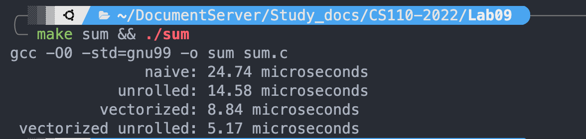
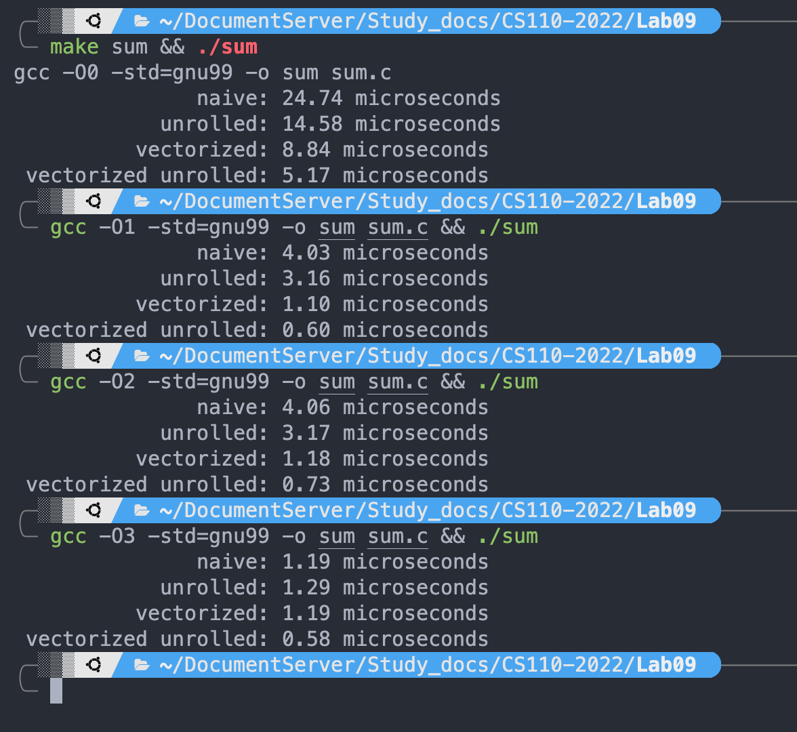

# Lab09


## Exercise 1: Familiarize yourself

- 4 floating point divisions in single precision: 

  ```c
  __m128 _mm_div_ps (__m128 __A, __m128 __B)
  ```

- 16 max operations over signed 8-bit integers:

  ```c
  __m128i _mm_max_epi8 (__m128i __X, __m128i __Y)
  ```

- Arithmetic shift right of eight signed 16-bit integers

  ```c
  __m128i _mm_sra_epi16 (__m128i __A, __m128i __B)
  __m128i _mm_srai_epi16 (__m128i A, int imm8)
  ```


## Exercise 2: Reading SIMD code

> Does the loop actually exist?

Yes.

The intel flavor assembly code snippet is:

```assembly
# variable 'i' is located at -428[rbp]

		mov	DWORD PTR -428[rbp], 0   # i = 0
		jmp	.L4
.L14:
		### Loop body here 
		add	DWORD PTR -428[rbp], 1   # i++
.L4:
		cmp	DWORD PTR -428[rbp], 1   # if i <= 1 goto L14
		jle	.L14
```


## Exercise 3&4: SIMD code and Loop Unrolling

The result is as follows:




## Exercise 5: Switch on compiler optimization

### Results:




### Explanation:

Let's focus on the `int sum_naive(int, int *)` function. The original c-code is 

```c
int sum_naive( int n, int *a ){
    int sum = 0;
    for( int i = 0; i < n; i++ )
        sum += a[i];
    return sum;
}
```

The assembly code are compiled with 

```sh
gcc -O0 -std=gnu99 -o sum_naive_O0.s sum.c -S -masm=intel  # O0
gcc -O2 -std=gnu99 -o sum_naive_O2.s sum.c -S -masm=intel  # O2
gcc -O3 -std=gnu99 -o sum_naive_O3.s sum.c -S -masm=intel  # O3
```

#### O2 compared with O0

With -O2 optimization, there're mainly these changes in the assembly code

- Function inlined.

  `push rbp`, `pop rbp` along with all the operations related to `rbp` are removed.

- Some variables removed.

  Variable `int i` and `int *a` is combined into one single variable, `rsi` register.

  `i++` operation is also removed, `a++` instead.

- Some variables are placed on registers, instead of on stack (on memory).

  For example, the iteration operation, `add  DWORD PTR -4[rbp], 1`, is optimized into `add rsi, 4`.

  The for loop condition check operation, `cmp eax, DWORD PTR -20[rbp], jl .L5`, is optimized into `cmp  rsi, rdx,  jne .L3`

#### O3 compared with O2

With -O3 optimization, there're mainly these changes in the assembly code

- SSE instructions are used. 

  We can see the usage of `xmm` registers in the assembly.

  
