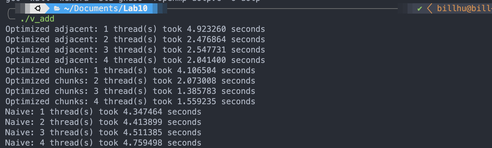
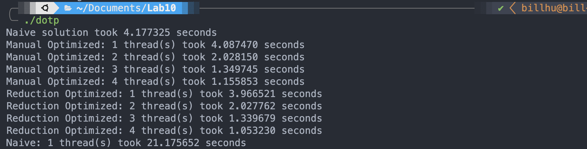

# Lab 10

## Exercise 1. hello

## Exercise 2. vector addition

## Exercise 3. dotp

'Reduction' method is slightly faster than the 'critical' method. This is because with the 'reduction' method, openmp will create a private variable for every thread storing the reduction result, and then sum up them thread, instead of using 'lock' to make sure only 1 thread can execute the critical section.